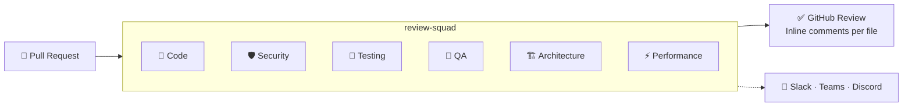
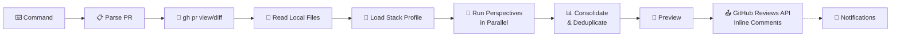

# review-squad

[](LICENSE)
[](CONTRIBUTING.md)

**Multi-perspective PR review powered by Claude Code. No servers, no SaaS — just your subscription.**

6 specialist review perspectives analyze your pull requests — each focused on a different concern (code quality, security, testing, QA, architecture, performance). Stack-specific profiles ensure reviews are relevant to your tech stack. Because it runs locally, review-squad has access to your full source code — not just the diff — so it can understand how changes fit into the broader codebase. And when it finds issues, you can ask Claude Code to fix them right there.

<!-- TODO: Add demo GIF here -->
<!--  -->



---

## What makes this different?

| Aspect | Cloud-based review tools | review-squad |
|--------|:------------------------:|:------------:|
| What is analyzed | Diff only | Diff + full source code on your machine |
| Fixing issues | Copy suggestion, switch tools | Ask Claude Code to fix it right there |
| Infrastructure | SaaS or self-hosted server | None — runs in your terminal |
| Cost model | Per review or per seat | Included in your Claude Code subscription |
| Customization | Config toggles | Markdown prompts you edit freely |
| Privacy | Code sent to third-party service | Code stays local (processed via Claude API) |

### Honest trade-offs

- **CI/CD integration**: Cloud tools run automatically on every PR; review-squad is manual — you run it when you want.
- **Team coverage**: Cloud tools cover the whole team at once; review-squad is an individual reviewer's tool.
- **Automation**: Cloud tools can auto-comment on every PR; review-squad runs on-demand.

---

## How it works

```
1. You run a command          →  /full-review org/repo#123 --focused
2. Fetch PR data              →  gh pr view/diff gets metadata and changes
3. Read local source files    →  Claude reads full files from your checkout (not just the diff)
4. Load stack profile         →  Picks the right checklist for your tech stack
5. Analyze from perspectives  →  Up to 6 review perspectives run in parallel
6. Preview                    →  You see the full report before anything is posted
7. Fix in place (optional)    →  Ask Claude Code to fix issues it found
8. Post                       →  GitHub Reviews API posts inline comments per file
9. Notify (optional)          →  Slack, Teams, or Discord notification
```

---

## Cost

| Plan | Price | Reviews |
|------|-------|---------|
| Claude Pro | $20/month | Included |
| Claude Max 5x | $100/month | Included |
| Claude Max 20x | $200/month | Included |
| Claude Team | $30/user/month | Included |

**Estimated usage**: a full-review on a medium PR (~300 lines) uses approximately 50–100K tokens across all perspectives.

**Usage estimation built-in**: Set `REVIEW_VERBOSE=true` in `.env` to see token usage, estimated API cost, and plan window percentage after each review. Data comes from `pricing.json` (update with `/update-pricing`). Configure your plan in `config.json > review.usage.active_plan`.

---

## Review Tiers

| | Quick | Focused | Full |
|---|:---:|:---:|:---:|
| **Perspectives** | Code only | Code, Security, Testing, QA | All 6 |
| **Local context** | Diff only | Diff + up to 15 related files | Diff + up to 30 related files |
| **Severity filter** | Critical & Major only | All severities | All severities |
| **Use when** | Fast sanity check | Standard review | Deep analysis |
| **Flag** | `--quick` | `--focused` (default) | `--full` |

Configure the default tier in `config.json > review.default_tier`.

---

## Quick Start (30 seconds)

**Prerequisites:** [Claude Code](https://docs.anthropic.com/en/docs/claude-code) + [GitHub CLI](https://cli.github.com/) (`gh auth login`)

```bash
# 1. Clone
git clone https://github.com/your-username/review-squad.git
cd review-squad

# 2. Configure
cp config.example.json config.json
# Edit config.json: set your GitHub org and repo mappings

# 3. Launch
claude

# 4. Review!
/list-prs --review-requested
/full-review your-org/your-repo#123
```

---

## Architecture



All "perspectives" are specialized prompts running in parallel — no microservices, no queues, no infrastructure.

---

## Commands

| Command | Description | Example |
|---------|-------------|---------|
| `/review-pr` | Code review with stack-specialized perspective | `/review-pr org/repo#42 --focused` |
| `/security-review` | OWASP Top 10, CVEs, secrets, injection | `/security-review org/repo#42` |
| `/test-review` | Test coverage, quality, anti-patterns | `/test-review org/repo#42` |
| `/qa-review` | Edge cases, regressions, breaking changes | `/qa-review org/repo#42` |
| `/architecture-review` | SOLID, layering, coupling, patterns | `/architecture-review org/repo#42` |
| `/performance-review` | O(n²), N+1, memory leaks, caching | `/performance-review org/repo#42` |
| `/full-review` | **All perspectives in parallel** + consolidated summary | `/full-review org/repo#42 --full` |
| `/list-prs` | List open PRs | `/list-prs --review-requested` |
| `/approve-pr` | Approve (with mandatory confirmation) | `/approve-pr org/repo#42` |
| `/update-pricing` | Fetch and update model pricing data | `/update-pricing` |

All commands accept: `owner/repo#123`, `repo#123` (uses default org), or full GitHub URL.
Tier flags (`--quick`, `--focused`, `--full`) are supported by `/review-pr` and `/full-review`.

---

## Stack Profiles

15 tech stack profiles with targeted checklists:

| Profile | Key Focus |
|---------|-----------|
| **.NET Core API** | Clean Architecture, DDD, SOLID, EF Core, FluentValidation |
| **.NET Background Service** | Idempotency, resilience, message queues, graceful shutdown |
| **.NET Auth Server** | OAuth2, JWT, PKCE, maximum security scrutiny |
| **.NET Shared Library** | SemVer, backward compatibility, API surface |
| **.NET Legacy API** | Tolerant review — focus on not making it worse |
| **TypeScript React** | Hooks, type safety, accessibility, performance |
| **TypeScript React Native** | Mobile perf, touch UX, Keychain, certificate pinning |
| **TypeScript Node.js** | Event loop, streams, graceful shutdown |
| **Python** | Type hints, ETL idempotency, Airflow, Pandas |
| **Vue.js** | Composition API, Pinia/Vuex, SFC structure |
| **SQL/T-SQL** | Idempotent scripts, index optimization, rollbacks |
| **Go** | Error handling, goroutines, interfaces, context |
| **Rust** | Ownership, lifetimes, unsafe, Result/Option |
| **Java Spring** | Bean lifecycle, transactions, JPA, Spring Security |
| **Default** | Generic code quality for unmapped repos |

Don't see your stack? [Add a profile](docs/ADDING-PROFILES.md) — it's one Markdown file.

---

## Review Perspectives

| Perspective | Focus | Key Checks |
|-------------|-------|------------|
| 📝 **Code** | Stack-specific quality | Profile checklist, code smells, patterns |
| 🛡️ **Security** | Vulnerabilities | OWASP Top 10, secrets, injection, CVEs |
| 🧪 **Testing** | Test coverage | Missing tests, anti-patterns, quality |
| 🎯 **QA** | Functional quality | Edge cases, regressions, compatibility |
| 🏗️ **Architecture** | Structural design | SOLID, layering, coupling, patterns |
| ⚡ **Performance** | Runtime efficiency | O(n²), N+1, memory, caching, async |

---

## Multi-Model Support

The profiles and templates are **model-agnostic** — pure domain knowledge in Markdown.

| Tool | Status | Details |
|------|--------|---------|
| **Claude Code** | ✅ Full support | Slash commands, parallel perspectives, gh CLI |
| **Cursor** | 🟡 Experimental | Via .cursorrules |
| **Aider** | 🟡 Experimental | Via .aider.conf.yml |
| **Codex CLI** | 🟡 Experimental | Via AGENTS.md |

See [Multi-Model docs](docs/MULTI-MODEL.md) for setup instructions.

---

## Configuration

Copy `config.example.json` → `config.json` and customize:

```jsonc
{
  "github": {
    "review_account": "your-github-username",
    "default_org": "your-org"
  },
  "review": {
    "language": "en",              // Review output language
    "default_tier": "focused",     // quick | focused | full
    "ignore_patterns": [...]       // Files to skip
  },
  "agents": {
    "full_review": ["code", "security", "testing", "qa"],
    "available": {
      "architecture": { "enabled": true },   // Enable additional perspectives
      "performance": { "enabled": true }
    }
  },
  "repo_profiles": {
    "your-org/api": "dotnet-core-api",       // Map repos to profiles
    "your-org/frontend": "typescript-react"
  }
}
```

See [examples/sample-config.json](examples/sample-config.json) for a complete example.

---

## Extending

| Want to... | How | Time |
|-----------|-----|------|
| Add a repo | Add one line to `config.json` | 30 sec |
| Add a stack profile | Create one .md file in `profiles/stacks/` | 5 min |
| Add a review perspective | Create .md profile + .md command | 10 min |
| Add a language (i18n) | Create one .json in `templates/i18n/` | 5 min |
| Add a tool integration | Create adapter in `integrations/` | 15 min |

See:
- [Adding Profiles](docs/ADDING-PROFILES.md)
- [Adding Agents](docs/ADDING-AGENTS.md)
- [Architecture](docs/ARCHITECTURE.md)

---

## Project Structure

```
review-squad/
├── config.example.json            # Template configuration
├── CLAUDE.md                      # Claude Code system instructions
├── pricing.json                   # Model pricing & plan limits
├── .env.example                   # Webhook URLs template
├── .claude/commands/              # 10 slash commands
├── profiles/
│   ├── stacks/                    # 15 tech stack profiles
│   └── agents/                    # 5 specialist review perspectives
├── templates/
│   ├── review-body.md             # Review body template
│   ├── review-comment.md          # Review comment template
│   ├── review-inline-comment.md   # Inline comment template
│   ├── review-summary.md          # Summary table template
│   ├── i18n/                      # en, pt-BR
│   └── notifications/             # Slack, Teams, Discord templates
├── integrations/                  # Claude Code, Cursor, Aider, Codex CLI
├── docs/                          # Architecture, guides
└── examples/                      # Sample outputs
```

---

## Sample Output

See complete examples:
- [Single perspective review](examples/sample-review-output.md) — `/review-pr` on a .NET API
- [Full 6-perspective review](examples/sample-full-review.md) — `/full-review` with consolidated summary

---

## Branch Strategy

```
feature/* ──→ develop ──→ staging ──→ main
fix/*     ──→ develop ──→ staging ──→ main
hotfix/*  ──→ main (emergency only)
```

| Branch | Purpose | Protection |
|--------|---------|------------|
| `main` | Stable, production-ready | PR + approval required, linear history enforced |
| `staging` | Homologation / pre-release testing | PR + approval required |
| `develop` | Active development | Protected from force push and deletion |

All PRs require maintainer approval. See the [Rulesets](https://github.com/Garbiati/review-squad/rules) for details.

---

## Contributing

Contributions welcome! The easiest way to contribute is adding a new [stack profile](docs/ADDING-PROFILES.md) or [review perspective](docs/ADDING-AGENTS.md).

**Quick steps:**
1. Fork the repo
2. Branch from `develop` (`feature/your-feature`)
3. Make changes and test locally
4. Open a PR targeting `develop`
5. Wait for maintainer review

See [CONTRIBUTING.md](CONTRIBUTING.md) for the full guide, branch naming conventions, and contribution types.

---

## License

[MIT](LICENSE)
