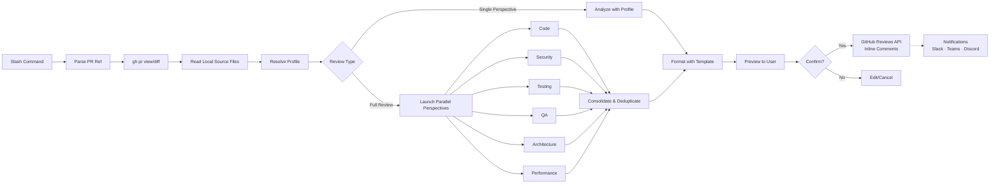
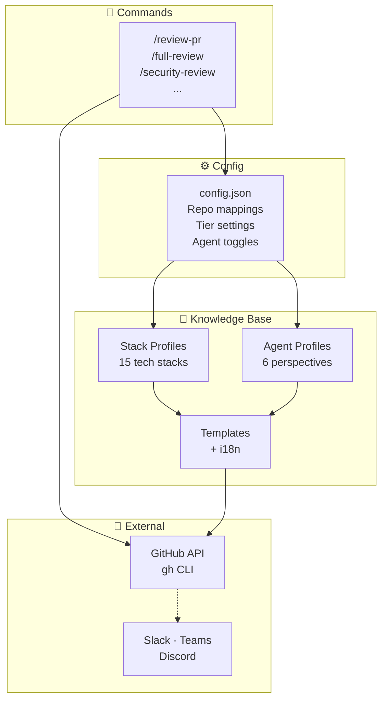

# Architecture

review-squad is a **prompt-only** system — zero executable code. It orchestrates AI coding tools (Claude Code, Cursor, Aider, Codex CLI) to perform multi-perspective PR code reviews via the `gh` CLI.

## Data Flow



## Component Overview



## Why Local Execution?

review-squad runs on the developer's machine, which gives it a unique advantage over cloud-based review tools:

- **Full source code access**: Cloud tools only see the PR diff. review-squad can read any file in the repository to understand how changes fit into the broader codebase — imports, callers, interfaces, configuration.
- **Fix in place**: When a review finds an issue, the developer can immediately ask Claude Code to fix it without switching tools or copying suggestions.
- **No infrastructure**: No servers to deploy, no webhooks to configure, no SaaS to subscribe to. It runs in your terminal with the tools you already have (`gh` CLI + Claude Code subscription).
- **Privacy**: Source code is processed via the Claude API but never sent to a third-party review service.

The trade-off is that review-squad is an individual reviewer's tool (not a team-wide CI integration) and must be invoked manually.

## Review Tiers

review-squad supports three tiers of review depth:

| Tier | Perspectives | Local context | Severity filter | Use case |
|------|-------------|---------------|-----------------|----------|
| **quick** | Code only | Diff only | Critical & Major | Fast sanity check |
| **focused** | Code, Security, Testing, QA | Up to 15 files | All | Standard review |
| **full** | All 6 | Up to 30 files | All | Deep analysis |

Tiers are configured in `config.json > review.tiers` and selected via `--quick`, `--focused`, or `--full` flags. The default is `config.json > review.default_tier`.

## Directory Structure

```
review-squad/
├── CLAUDE.md                          # System instructions for Claude Code
├── config.json                        # User config (git-ignored)
├── config.example.json                # Template config
├── pricing.json                       # Model pricing & plan limits
├── .env.example                       # Webhook URLs template
├── .claude/
│   ├── commands/                      # Slash commands (review flows)
│   │   ├── review-pr.md              # Stack-specialized review
│   │   ├── security-review.md        # Security-focused review
│   │   ├── test-review.md            # Testing-focused review
│   │   ├── qa-review.md              # QA-focused review
│   │   ├── architecture-review.md    # Architecture-focused review
│   │   ├── performance-review.md     # Performance-focused review
│   │   ├── full-review.md            # All perspectives in parallel
│   │   ├── list-prs.md              # List open PRs
│   │   ├── approve-pr.md            # Approve PR with confirmation
│   │   └── update-pricing.md        # Fetch model pricing data
│   └── settings.local.json           # Permissions and hooks
├── profiles/
│   ├── stacks/                        # Review checklists per tech stack
│   │   ├── dotnet-core-api.md
│   │   ├── dotnet-core-service.md
│   │   ├── dotnet-auth.md
│   │   ├── dotnet-shared-lib.md
│   │   ├── dotnet-legacy-api.md
│   │   ├── typescript-react.md
│   │   ├── typescript-react-native.md
│   │   ├── typescript-node.md
│   │   ├── python.md
│   │   ├── vue.md
│   │   ├── sql.md
│   │   ├── go.md
│   │   ├── rust.md
│   │   ├── java-spring.md
│   │   └── default.md
│   └── agents/                        # Specialist review perspectives
│       ├── security.md
│       ├── testing.md
│       ├── qa.md
│       ├── architecture.md
│       └── performance.md
├── templates/
│   ├── review-body.md                 # Review body template
│   ├── review-comment.md             # Review comment template
│   ├── review-inline-comment.md      # Inline comment template
│   ├── review-summary.md             # Consolidated summary template
│   ├── i18n/
│   │   ├── en.json                   # English labels
│   │   └── pt-BR.json               # Portuguese labels
│   └── notifications/
│       ├── slack.json                # Slack webhook template
│       ├── teams.json                # Teams webhook template
│       └── discord.json              # Discord webhook template
├── integrations/
│   ├── claude-code/                   # Primary integration
│   ├── cursor/                        # Cursor adapter
│   ├── aider/                         # Aider adapter
│   └── codex-cli/                     # Codex CLI adapter
├── docs/                              # Documentation
├── examples/                          # Sample outputs
└── .github/                           # Issue/PR templates
```

## Extension Points

### Adding a Stack Profile
Create `profiles/stacks/your-stack.md` with:
1. Tech stack description
2. Architectural patterns
3. Review checklist with `- [ ]` items

Then add repo mappings in `config.json > repo_profiles`.

### Adding a Specialist Perspective
1. Create `profiles/agents/your-perspective.md` with role, analysis scope, and output format
2. Create `.claude/commands/your-perspective-review.md` with the command flow
3. Add the perspective to `.claude/commands/full-review.md`
4. Add to `config.json > agents.available`

### Adding an Integration
1. Create `integrations/your-tool/` with tool-specific config files
2. Reference the shared profiles and templates
3. Document setup in a README.md

## Design Decisions

### Why Prompts, Not Code?
- **Zero infrastructure**: No servers, no CI, no build step
- **Model-agnostic**: Profiles are pure domain knowledge, usable by any AI tool
- **Instantly extensible**: Add a profile = create one .md file
- **Transparent**: Every review decision can be traced to a specific checklist item

### Why Parallel Perspectives?
Each perspective has a focused lens (security sees things code quality misses, QA catches what testing overlooks). Running in parallel gives comprehensive coverage without the "serial review" bottleneck.

### Why `gh` CLI?
- Already authenticated in most dev environments
- Rich JSON output for parsing
- Native PR review posting
- No API tokens to manage beyond what `gh` already handles
